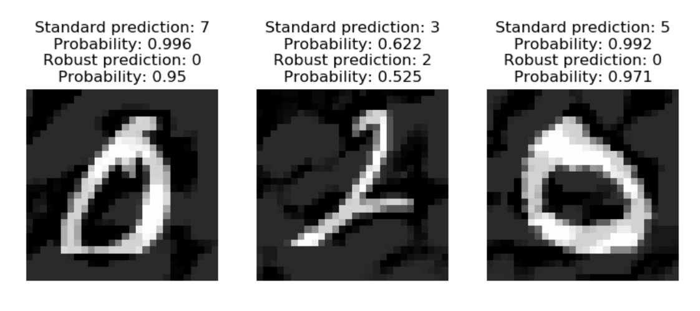

# adversarial-robustness
IBIO 4615 2021-2 Adversarial Robustness Homework

## Requirements
```
pandas
torchvision
torch
```
### Bonus
For the bonus you will require the AutoAttack implementation, available in the following [repository](https://github.com/fra31/auto-attack). It can be downloaded using the this command:
```
pip install git+https://github.com/fra31/auto-attack

```
## General Indications

This homework consists of two parts. In the first part (**2.5 pts**), you will generate adversarial attacks. In the second part (**2.5 pts**), you will train models to be robust to adversarial attacks. Although my suggestion is to complete them in the presented order, they are designed to be independent, so you can tackle them in the order that you want. A code skeleton named as `main.py` is provided for both parts. You are expected to complete your tasks in the designated spaces of these files. This are the only files that will be executed during evaluation. The `main.py` file of the first part will be run once, and all tasks are expected to be executed. The `main.py` file of the second part will be run five times, once per each possible value of the variable `mode`. In order to achieve all the possible points for this homework, your code is expected to correctly execute the tasks when the main.py files are run as previously described.

The first part of this homework does not require a GPU. The second part requires CUDA implementations, and the estimated time of each experiment is highly dependent of the parameters selected. It is ***highly recommended*** that you read the whole code skeleton and be sure to understand the already implemented functions before completing your tasks.

An important portion of the code was retrieved from [this webpage](https://adversarial-ml-tutorial.org/). However, most of the tasks were hand-crafted by myself, so I really hope that you enjoy this homework 😊.

## Tasks

### Part 1: Adversarial Attacks

0. Load an image of your preference that corresponds to an instance of the 1000 ImageNet classes listed in the imagenet_class_instance.json file.
1. Edit the untargeted_attack() function in order to satisfy the steps described in the code skeleton. Justify your changes to the code skeleton (**0.25 pts**).
2. Tune the epsilon, alpha and num_iter parameters of the `untargeted_attack()` function in order to obtain an adversarial attack that successfully generates a misclassification in the loaded ResNet50 model pre-trained in the ImageNet dataset. Discuss about how the ranking of the top 5 classes with higher probability predicted by the model changed after the attack (**0.50 pts**).
3. Write a function that allows you to visualize your original image, a magnification of the perturbation, and the adversarial example that results of the implementation of the `untargeted_attack()` function. The visualization should follow a 1x3 subplot format. The title of each subplot must be the predicted class according to the model, among with its probability. This is similar to the Panda example presented in class. Discuss about how your visualization was expected or not according to your knowledge about adversarial attacks (**1.00 pts**)
  - Hints:
    - The inference of the model (`pred` in the following code) corresponds to a 1000 dimensional vector containing the logits for the 1000 ImageNet classes: `pred = model(norm(image_tensor))`
    - The logits are not probabilities. You must apply the softmax function in order to obtain the probabilities from the logits. This can be achieved through the following line of code: `probability = nn.Softmax(dim=1)(pred)[0, class].item()`
    - In order to obtain a numpy array that can be plotted as an image through the function `matplotlib.pyplot.imshow()`, the tensors returned by the dataloader should be transformed in the following way: `example_tensor.numpy().transpose(1, 2, 0)`
    - Your figure is expected to look like this:


4. Based on the previously implemented `untargeted_attack()` function, define an adapted function for a targeted attack. This function will also receive as a parameter the index of one of the 1000 ImageNet classes. Implement this function and generate a successful targeted attack to a class of your interest which is not among the top 5 most probable classes according to the initial inference. Visualize this attack using the function implemented in the last task. Discuss about how the ranking of the top 5 classes with higher probability predicted by the model changed after the attack (**0.75 pts**).

### Part 2: Adversarial Training

5. Based on the `main_standard()` function, create a `main_adversarial()` function that performs adversarial training over an architecture and evaluates it with the tests set and with adversarial examples generated from the test set. Hint: You just have to change one line of code. Implement this code to train a model with adversarial training. Justify your changes to the original function. Compare the pipeline of a standard training and an adversarial training. (**0.25 pts**)
6. Generate a 1x2 subplot in which you visualize the train, test and adversarial error as a function of the number of training epochs for a) the model with standard training, b) the model with adversarial training. When you run the code with `mode="plot_error"`, this figure should be shown and saved with the path `"errors.png"`. Report this figure in the article and analyze it. (**0.50 pts**)
7. Experiment by training various models with adversarial examples. Compare their errors when varying the following conditions:
  a.	The type of attack and its parameters (fgsm and pgd - epsilon, alpha, number of iterations, etc.)
  b.	PGD with zero and random initialization.
  c.	The model architecture.
  d.	The training epochs and learning rate.
You should only report your experiments and results in the article. However, when you run the code with `mode="best_model"`, your best model should be trained, and its parameters should be saved as `'best_model.pt'`. ***IMPORTANT***: Take into account that you can train models with different attacks, but in order to make their performance comparable, they must be *evaluated* with the same type of attack. Design your own experimental set-up and create new functions if you require it. (**1.25 pts**)
8. Visualize 3 adversarial examples that your baseline standard model misclassifies and your model with the lowest adversarial error classifies correctly as a 1x3 subplot. Indicate the classes predicted by each model among with its probability. When you run the code with `mode="examples"`, this figure should be shown, and it should be saved with the path `examples.png`. Discuss your results in the article. (**0.50 pts**)
- Hints
  - It might be useful to obtain individual random instances of images and annotations of the MNIST dataset. This can be achieved by creating a dataloader with a batch size of 1, and retrieving one iteration:
```
unit_loader = DataLoader(mnist_test, batch_size = 1, shuffle=True)
img, label = next(iter(unit_loader))
```
  - In order to use the functions that generate the adversarial examples through PGD and FGSM and are already implemented, the images and labels returned by the dataloader should be passed to the GPU. 
  - The inference returned by the models is a 10 dimension tensor with the logits associated to every handwritten number ordered from 0 to 9 (`pred`). In this order of ideas, a simple way to obtain the predicted class is: `class = torch.argmax(pred).item()`
  - Your figure is expected to look like this:



### Bonus:

a. Run AutoAttack on your best model! Check the documentation available in [this repository](https://github.com/fra31/auto-attack). Use `norm='Linf'` and `eps=0.3` as parameters. Compare your robust accuracy to the SOTA in MNIST (reported in the AutoAttack repository). I encourage you to complete this bonus. It is easy and it might be useful if you wish to incorporate adversarial robustness in your projects. (**0.50 pts**)

b. The student that achieves the highest robust accuracy with AutoAttack among the class will receive a **0.50** pts additional bonus. You are encouraged to share your highest robust accuracy in a thread on the Slack homework channel to simulate a ranking board. 


